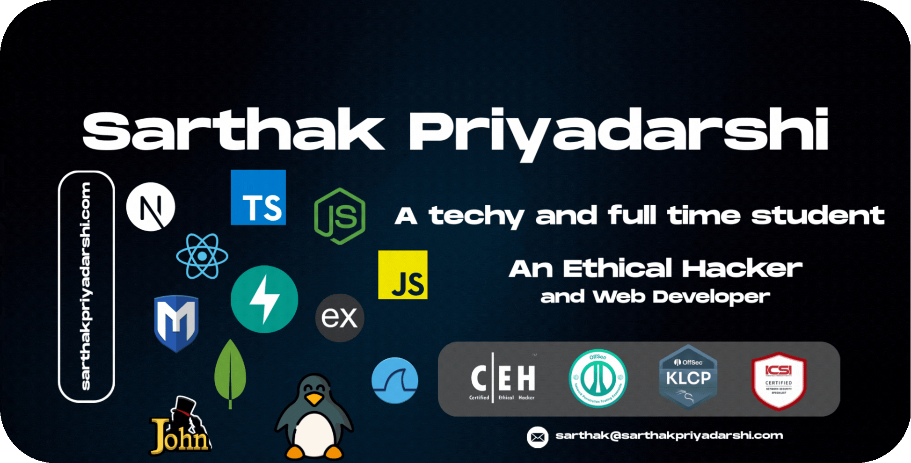

   <a href="https://cyberol.codes">
      <picture>
        <source media="(prefers-color-scheme: dark)" srcset="./assets/banner.gif" alt="About Me heading">
        
      </picture>
   </a>
   

   

      <h3>You are visitor number:</h3>
      
   

   

   

      
      
      
      
      
      
      
      
      
      
      
      
      
      
      
      
      
      
      
      
      
      
      
      
      
      
      
      
      
      
      
      
      
      
      
   

   

   
I am an Ethical Hacker and Full Stack Web Developer who is eager to learn and apply new technology to production level use. I am skilled in both backend and frontend but specifically. I mean I am still a student, so still learning but I love to contribute to existing open source project or maybe creating it.
   

   &nbsp;&nbsp;
   &nbsp;&nbsp;

   

   <h2>Little Stats Here and There!</h2>
   

     <picture>
         <source media="(prefers-color-scheme: dark)" srcset="https://nirzak-streak-stats.vercel.app/?user=sarthakpriyadarshi&theme=nightowl&hide_border=false" alt="Sarthak Priyadarshi's Tech Stack Stats">
         
     </picture>
   

   

     <picture>
         <source media="(prefers-color-scheme: dark)" srcset="https://github-readme-stats.vercel.app/api/top-langs/?username=sarthakpriyadarshi&theme=nightowl&hide_border=false&include_all_commits=false&count_private=false&layout=compact" alt="Sarthak Priyadarshi's Streaks Stats">
          
         
     </picture>
   

   

   <h3>Contact Me at: <a href="mailto:sarthak@cyberol.codes">sarthak@cyberol.codes</a></h3>
   

